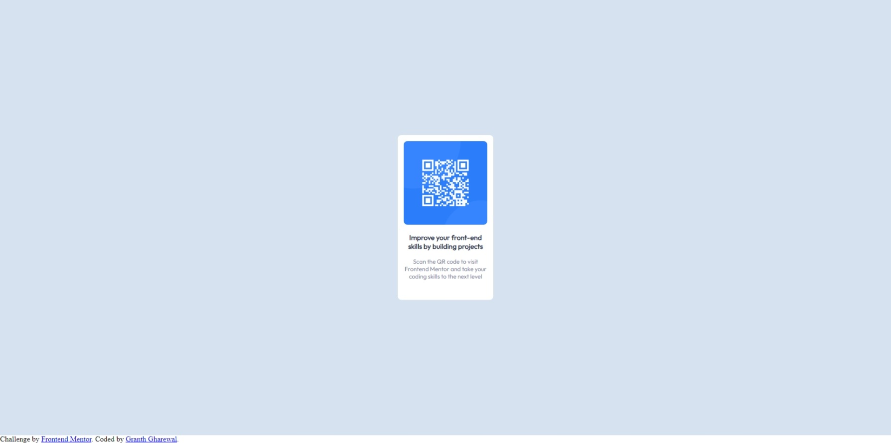

# Frontend Mentor - QR code component solution

This is a solution to the [QR code component challenge on Frontend Mentor](https://www.frontendmentor.io/challenges/qr-code-component-iux_sIO_H). Frontend Mentor challenges help you improve your coding skills by building realistic projects.

## Table of contents

- [Overview](#overview)
  - [Screenshot](#screenshot)
  - [Links](#links)
- [My process](#my-process)
  - [Built with](#built-with)
  - [What I learned](#what-i-learned)
  - [Continued development](#continued-development)
  - [Useful resources](#useful-resources)
- [Author](#author)
- [Acknowledgments](#acknowledgments)

## Overview

### Screenshot



### Links

- Solution URL: [Add solution URL here](https://codesandbox.io/s/challenge-1-w2w95g)
- Live Site URL: [Add live site URL here](https://w2w95g.csb.app/)

## My process

### Built with

- CSS custom properties
- Flexbox
- [React](https://reactjs.org/) - JS library

### What I learned

In this challenge I learned about the use of following css properties

```css
display: flex;
```

Which I used to center the qr code.

```css
min-height: 100vh;
```

I used this to ensure the background color covers the entire viewport height.

## Author

- Frontend Mentor - [@gharewal12](https://www.frontendmentor.io/profile/gharewal12)
